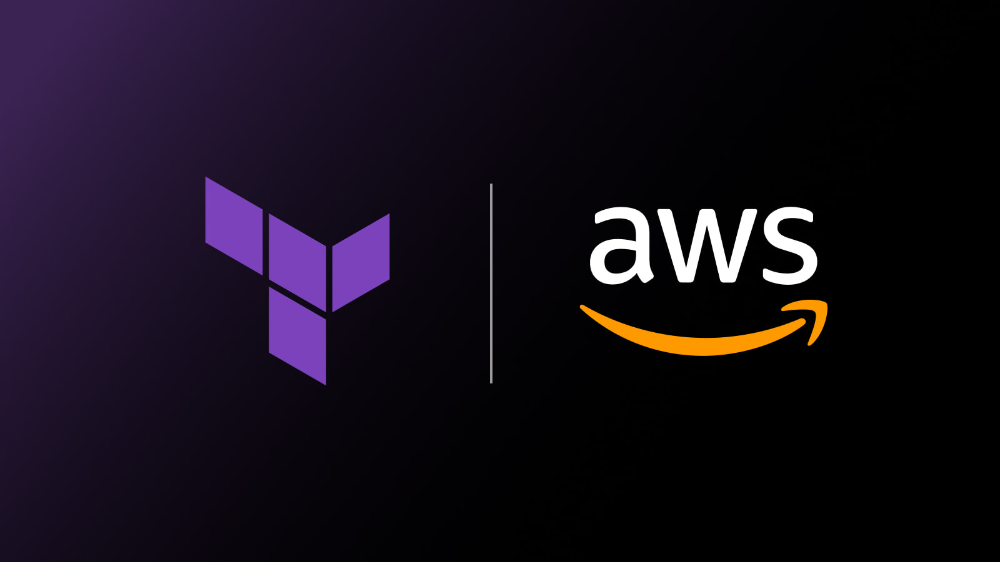

  

# Terraform AWS Solution Architect (TASA)

If you want to learn aws solution architect, you need to start it as a code and kill all the topics,So let's stop talking and start rolling the ball.

- [01-IAM]() In Progress
  - [IAM-policy](https://github.com/devopshobbies/terraform-aws-solution-architect/tree/main/01-iam/iam-policy)
  - [IAM-role] In Progress
  - [IAM-user](https://github.com/devopshobbies/terraform-aws-solution-architect/tree/main/01-iam/iam-user)
- [02-EC2]() In Progress
- [03-RDS]() In Progress
- [04-S3bucket]() In Progress
- [05-Route53]() In Progress
- [06-CloudFront]() In Progress
- [07-SNS]() In Progress
- [08-ECS]() In Progress
- [09-EKS]() In Progress
- [10-ECR]() In Progress
- [11-CloudWatch]() In Progress
- [12-VPC]() In Progress
- [13-Redshift]() In Progress
- [14-Glue]() In Progress
- [15-MSK]() In Progress
- [16-Neptune]() In Progress
- [17-LB]() In Progress
  - [ALB]() In Progress
  - [NLB]() In Progress
  - [GWLB]() In Progress
- [18-ASG]() In Progress
- [19-SG]() In Progress
- [20-KMS]() In Progress
- [21-cloudtrail]() In Progress
- [22-waf]() In Progress
- [23-SQS]() In Progress
- [24-ACM]() In Progress
- [25-EFS]() In Progress
